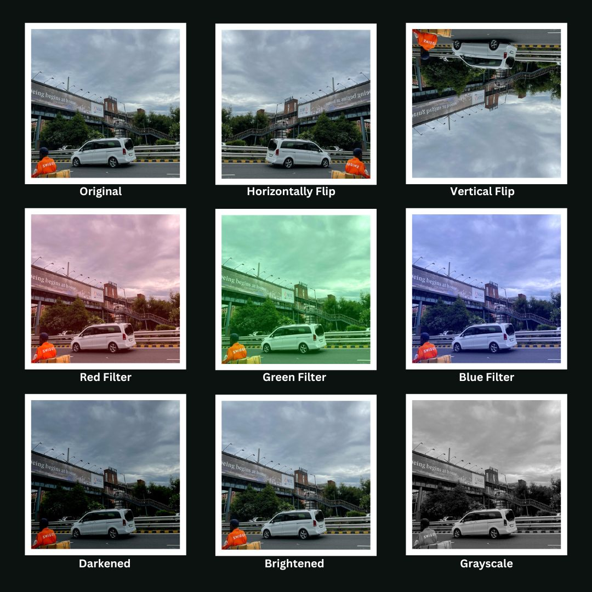

# ImagePixelizer

A library which performs wide range of image processing operations on Portable Pixmap (.ppm) images. It provides a versatile toolkit for manipulating and enhancing images, including operations like image resizing, flipping, applying filters, adjusting brightness, etc.
<p align = "center">

  <br>
  <br>
  
```ImagePixelizer``` offer range of features for manipulating images in the `.ppm` format of type `P3`:-
1. ```read_image('imagepath.ppm')```: Reads image from the path given as an argument.
2. `resize(width, height)`: Resizes the image as per width and height provided in the argument.
3. `set_width(cropped_width_size)`: Adjusts the width as per the argument without changing the height.
4. `set_height(cropped_height_size)`: Adjusts the height as per the argument without changing the width.
5. `horizontal_flip()`: Flips the image horizontally.
6. `vertical_flip()`: Flips the image vertically.
7. `applyfilter_red()`: Applies red filter to the image.
8. `applyfilter_blue()`: Applies blue filter to the image.
9. `applyfilter_green()`: Applies green filter to the image.
10. `applyfilter_grayscale()`: Applies grayscale to the image.
11. `adjust_brightness(amount)`: Adjusts brightness as per amount (to decrease brightness amount < 0).
12. `write_image('name.ppm')`: Save the image with the same name provided in the argument.

### Usage
``` 
git clone https://github.com/TheAPratap/ImagePixelizer.git
cd ImagePixelizer
git clone https://github.com/pybind/pybind11.git
mkdir build && cd build
cmake ..
make
```
Insert `.ppm` image of type `P3` in the build directory to use the `ImagePixelizer` library.
Open python shell in the same directory and import `ImagePixelizer`:
```
python3
>>> import ImagePixelizer
>>> x = ImagePixelizer.ImageEdits()
>>> x.read_image("path_of_img")                    # To read the image
>>> x.resize(provide_width, provide_height)        # To resize the image
>>> x.set_width(width_size)                        # To adjust width of the image
>>> x.set_height(height_size)                      # To adjust height of the image
>>> x.horizontal_flip()                            # To flip image horizontally
>>> x.vertical_flip()                              # To flip image vertically
>>> x.applyfilter_red()                            # To apply red filter
>>> x.applyfilter_green()                          # To apply green filter
>>> x.applyfilter_blue()                           # To apply blue filter
>>> x.applyfilter_grayscale()                      # To apply grayscale filter
>>> x.set_image_path()                             # To change the image path
>>> x.adjust_brightness(amount)                    # To adjust brightness of an image
>>> x.write_image("path/filename_to_write")        # To save the image with the name given in the argument
```
### Structure
```
|-- include
  |-- ImgManipulator.hpp
|-- src
  |-- ImgManipulator.cpp
|-- pymain.cpp
|-- CMakeLists.txt
|-- output
|-- README.md
```
  </p>
